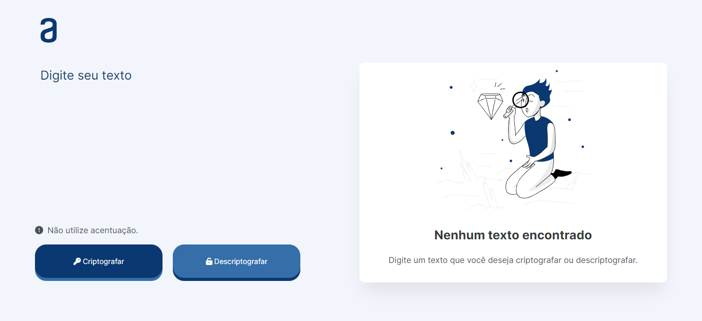
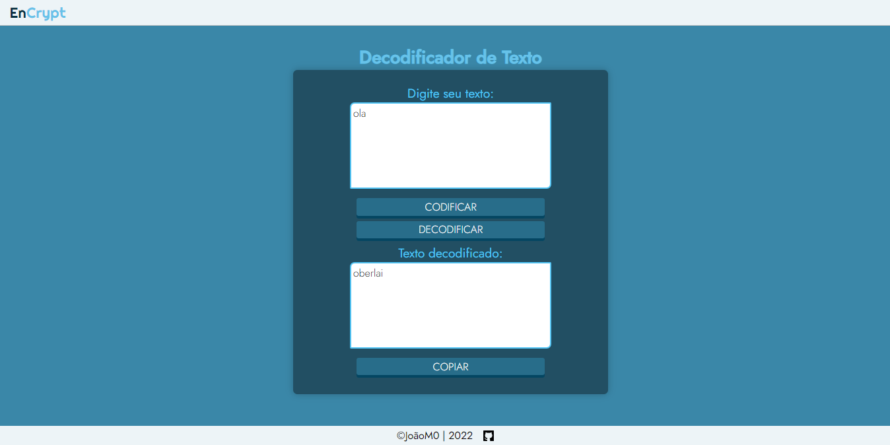

## 📌 Tópicos

- [Sobre](#sobre)
- [Objetivo](#objetivo)
- [Vizualizar Projeto](#vizualizar-projeto)
- [Ferramentas](#🛠️-ferramentas)
- [Aprendizado](#📚-aprendizado)
- [Extra](#extra)

## Sobre

Esse desafio foi proposto pela Alura em Parceria com Oracle que desenvolveu um Programa chamado ONE — Oracle Next Education que com a Alura disponibilizou alguns cursos de Lógica de Programação.

Esse desafio faz parte desses cursos com o intuito de colocar em prática o que foi visto e a buscar por outras fontes de ensinamento como a própria Documentação.

## Objetivo

Objetivo desse projeto consiste em criptografar um texto qualquer, que altere somente suas vogais por:

- a -> "ai"
- e -> "enter"
- i -> "imes"
- o -> "ober"
- u -> "ufat"

Após o texto ser criptografado seja possível copia-ló e então descriptografar, assim voltando ao seu estado original:

- gaitober -> "gato"
- loberbober -> "lobo"
- gimesthufatb -> "github"

## Vizualizar Projeto

[💻 Veja o projeto funcionando.](https://joaopdr3.github.io/text-decoder-challenge/)

## 🛠️ Ferramentas

- HTML5
- CSS3
- JavaScript
- Ícones retirados do [🔗 Font Awesome.](https://fontawesome.com/)
- Imagens retiradas do [🔗 Layout do Desafio.](<https://www.figma.com/file/XqmWWW3PcR2nL1MQbyjrB8/Alura-Challenge---Desafio-1---L%C3%B3gica-(Copy)?node-id=0%3A1>)

## 📚 Aprendizado

- HTML Semântico.
- CSS
  - Flexbox.
  - Animação de elementos como exemplo, transição.
  - Posição dos elementos.
  - Responsividade.
- Organização de arquivos e pastas.
- JavaScript
  - Funções e Condicionais.
  - Manipulação do DOM, como exemplo:
    - Alteração no estilo do elemento.
    - No conteúdo do elemento.
    - Na exibição do elemento.
  - Eventos
  - RegEx Básico, para validação do texto inserido.
  - Utilização da função setTimeout() para executar um código depois de um determinado tempo.
  - Função replace() para substituição das vogais e também para voltar ao seu estado original.

## Extra

Realizei várias mudanças nesse projeto, começando pelo layout que antes era assim:

Tentei seguir mais ou menos fiel ao próprio layout do desafio que foi fornecido, como base de aprendizado também.

Outras mudanças foram no código, que infelizmente não tenho uma prévia para visualização aqui, mas é possível ver através dos commits anteriores.

Um detalhe final foi somente na organização dos arquivos.
